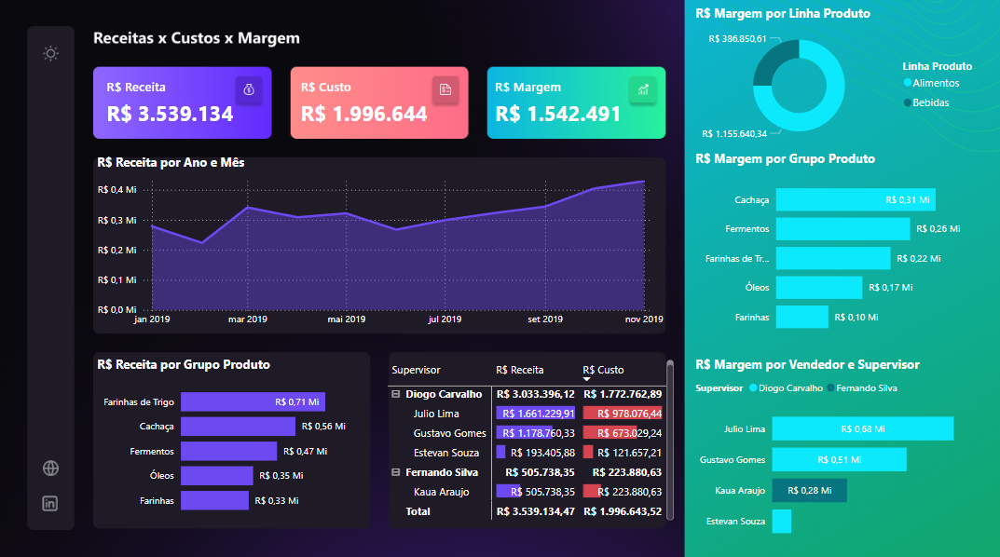

# Dashboard de Vendas - Power BI

📊 Projeto feito em Power BI para análise de vendas.

## Principais Métricas:

- Receita Total  
- Custo Total  
- Margem de Lucro  
- Receita por Ano e Mês  
- Receita por Grupo de Produto  
- Margem por Linha de Produto  
- Margem por Grupo de Produto  
- Margem por Vendedor e Supervisor  

## Como abrir:

1. Faça o download do arquivo `Projeto4.pbix`
2. Abra com Power BI Desktop

## Prints do dashboard:

*(Adicione aqui imagens do seu projeto)*  
Exemplo:  

---

Feito com 💜 por Manuella
